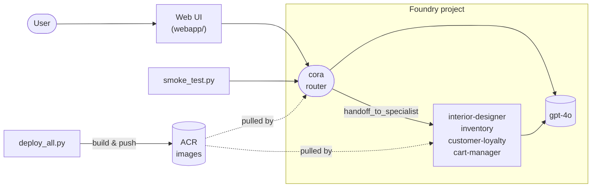

# Foundry Hosted Agents - Zava (Microsoft Agent Framework)

A multi-hosted-agent rewrite of the
[TechWorkshop-L300-AI-Apps-and-agents](https://github.com/microsoft/TechWorkshop-L300-AI-Apps-and-agents)
Zava shopping assistant, built on **Microsoft Agent Framework** and deployed
as **container/hosted agents** per
[Microsoft Foundry hosted agents](https://learn.microsoft.com/azure/foundry/agents/concepts/hosted-agents).

Each specialist agent is a separate immutable hosted agent (own image, own
per-agent Microsoft Entra identity, own Responses endpoint). Cora (the
public-facing router) calls the specialists over the project's Responses
protocol via a `handoff_to_specialist` tool.

## Agents

| Agent | Tools | Purpose |
|---|---|---|
| `cora` | `handoff_to_specialist`, `list_products` | Greets the user, browses, routes |
| `interior-designer` | `list_products` | DIY + design recommendations |
| `inventory` | `inventory_check` | Stock & warehouse lookups |
| `customer-loyalty` | `calculate_discount` | Tiered loyalty discounts |
| `cart-manager` | `add_to_cart`, `view_cart`, `clear_cart` | Cart operations |

All five agents share `shared/agent_host.py` (an `Agent` + `FoundryChatClient`
wrapped by `azure.ai.agentserver.agentframework.from_agent_framework`).

## Architecture



**Request flow:** the user hits the Web UI (or calls Cora's Responses
endpoint directly). Cora runs in a per-session container, calls `gpt-4o`
through `FoundryChatClient`, and either answers directly or invokes
`handoff_to_specialist`, which forwards the message to a specialist
hosted agent over the project's Responses protocol. Each agent has its
own image in ACR and its own per-agent Entra identity.

## Deploy

### Option A: `azd up` (recommended)

The repo ships with an [`azure.yaml`](azure.yaml) that wires `azd` end-to-end:

1. Provisions infra from `infra/main.bicep` (Foundry account/project, ACR,
   `gpt-4o` deployment, Storage account for shared cart state, RBAC).
2. Runs the `postdeploy` hook, which builds + pushes one image per agent,
   registers a hosted-agent version, then grants the cart-manager
   identity `Storage Blob Data Contributor` on the storage account so the
   cart tools can read/write the shared blob.

```powershell
# One-time prereqs
az login
azd auth login

# Optional: pre-create a Python venv so the postdeploy hook reuses it
python -m venv .venv
.\.venv\Scripts\Activate.ps1
pip install -r shared/requirements-base.txt -r shared/requirements-af.txt

# Provision + deploy
azd up
```

`azd up` will prompt for an environment name, subscription, and location
(pick one where Foundry hosted agents are available, e.g.
`swedencentral`, `eastus2`, `francecentral`). On subsequent runs use
`azd deploy` to rebuild and re-register agents without re-provisioning,
or `azd provision` for infra-only changes.

To tear everything down:

```powershell
azd down --purge
```

### Option B: `az` CLI (manual)

If you prefer not to use `azd`, provision and deploy by hand:

```powershell
cd <path-to-repo>
az login
az group create -n hostedagents -l swedencentral
az deployment group create -g hostedagents -f infra/main.bicep -p location=swedencentral
```

The template emits `AZURE_AI_PROJECT_ENDPOINT`,
`AZURE_CONTAINER_REGISTRY_ENDPOINT`, `AZURE_STORAGE_BLOB_ENDPOINT`, and
`AZURE_STORAGE_CART_CONTAINER` as outputs. Capture them and export to your
shell, then build, push, and register all 5 hosted agents:

```powershell
$outputs = az deployment group show -g hostedagents -n main --query properties.outputs -o json | ConvertFrom-Json
$env:AZURE_AI_PROJECT_ENDPOINT         = $outputs.AZURE_AI_PROJECT_ENDPOINT.value
$env:AZURE_CONTAINER_REGISTRY_ENDPOINT = $outputs.AZURE_CONTAINER_REGISTRY_ENDPOINT.value
$env:AZURE_STORAGE_BLOB_ENDPOINT       = $outputs.AZURE_STORAGE_BLOB_ENDPOINT.value
$env:AZURE_STORAGE_CART_CONTAINER      = $outputs.AZURE_STORAGE_CART_CONTAINER.value

az acr login -n $env:AZURE_CONTAINER_REGISTRY_ENDPOINT.Split('.')[0]
python ./scripts/deploy_all.py
```

After the cart-manager agent is registered for the first time, grant its
instance identity `Storage Blob Data Contributor` on the storage account by
re-running the deployment with the principal id:

```powershell
$cartPid = az rest --method GET `
  --url "$env:AZURE_AI_PROJECT_ENDPOINT/agents/cart-manager?api-version=2025-11-15-preview" `
  --resource https://ai.azure.com `
  --query "instance_identity.principal_id" -o tsv

az deployment group create -g hostedagents -f infra/main.bicep `
  -p location=swedencentral cartManagerPrincipalId=$cartPid
```

## Try it

```powershell
$ENDPOINT = "$env:AZURE_AI_PROJECT_ENDPOINT/agents/cora/endpoint/protocols/openai/v1/responses"
$TOKEN    = (az account get-access-token --resource https://cognitiveservices.azure.com --query accessToken -o tsv)

curl -X POST $ENDPOINT `
  -H "Authorization: Bearer $TOKEN" `
  -H "Content-Type: application/json" `
  -d '{"input":[{"role":"user","content":"Hi! I want to redo my living room in emerald and brass."}]}'
```

Cora will hand off to `interior-designer`, which uses `list_products` to
recommend pieces from the Zava catalog.

### Web chat UI

The Foundry portal Playground sometimes hides assistant replies for runs
that include tool calls / handoffs. A minimal FastAPI + HTML chat under
`webapp/` can be deployed to App Service — see
[`webapp/README.md`](webapp/README.md) for one-time setup. Once deployed,
point your browser at the App Service URL, pick an agent (`cora` and the
four specialists are listed), and chat. Each reply shows the tool calls it
triggered (e.g. `handoff_to_specialist`, `list_products`) underneath.

To run it locally instead, see [`webapp/README.md`](webapp/README.md).

### CLI smoke test

```powershell
$env:AZURE_AI_PROJECT_ENDPOINT = "https://<foundry>.cognitiveservices.azure.com/api/projects/<project>"
python scripts/smoke_test.py cora "Hi! What can you help me with?"
```

Prints the raw Responses payload (final `output_text` plus every tool
call) — handy for diagnosing handoff or model issues.

#### Scripted multi-turn shopping scenario

To exercise routing, inventory, and cart end-to-end, run the built-in
scripted conversation against `cora` (turns are threaded via
`previous_response_id`, so Cora keeps context between turns):

```powershell
python scripts/smoke_test.py --script
```

The script sends these seven turns:

1. What colors of green paint do you have?
2. I think I'm interested in Deep Forest. How many gallons would I need to paint a medium sized bedroom?
3. How much of PROD0018 do you have in stock?
4. Let's add two gallons to the cart, please.
5. Please also add one paint tray and two of your All-Purpose Wall Paint Brushes.
6. What items are in my cart right now?
7. I'd like to check out now.

Expected handoffs along the way: `interior-designer` (turns 1–2),
`inventory` (turn 3), `cart-manager` (turns 4–7).

## Compare with the original workshop

| | Original workshop | This repo |
|---|---|---|
| Agent kind | Prompt agents (`PromptAgentDefinition`) | Container/hosted agents |
| Where it runs | Foundry prompt runtime | Per-session VM sandbox |
| SDK | `azure.ai.projects` direct | Microsoft Agent Framework (`FoundryChatClient`) |
| Routing | `HandoffService` w/ structured-output classifier | Tool-call: `handoff_to_specialist` |
| Endpoint | Threads/runs API | `/agents/{name}/endpoint/protocols/openai/v1/responses` |
| Identity | Project MI | Per-agent Microsoft Entra identity |
| Deploy | Bicep + `agents.create_version(PromptAgentDefinition(...))` | Bicep + `docker build/push` + `agents.create_version(ContainerAgentDefinition(...))` |

## Layout

```
HostedAgent/
├── agents/
│   ├── cora/                {main.py, Dockerfile, agent.yaml}
│   ├── interior-designer/   ...
│   ├── inventory/           ...
│   ├── customer-loyalty/    ...
│   └── cart-manager/        ...
├── shared/
│   ├── agent_host.py        # FoundryChatClient + Agent + Responses HTTP server
│   ├── handoff.py           # Cora's handoff_to_specialist tool
│   ├── zava_tools.py        # local function tools (inventory, discount, cart)
│   ├── requirements.txt     # pinned agent-framework + agentserver
│   └── Dockerfile.base
├── data/product_catalog.json
├── infra/main.bicep         # Foundry + ACR + gpt-4o + Storage (cart) + RBAC
├── scripts/deploy_all.py    # build/push/register every agent
├── azure.yaml               # azd manifest (postdeploy = deploy_all.py)
└── README.md
```

## Notes / caveats

- SDK preview pins live in `shared/requirements-base.txt` /
  `shared/requirements-af.txt` (`agent-framework-*==1.2.2`,
  `azure-ai-agentserver-responses==1.0.0b5`,
  `azure-ai-agentserver-core>=2.0.0b3`). Update these together when bumping.
- The `cart-manager` agent persists cart state in an Azure Storage blob
  (`carts/default.json`) so cart contents survive handoffs between specialist
  containers. Other agents have no Storage dependency. Auth is AAD-only via
  the per-agent Entra identity (`Storage Blob Data Contributor`).
- Cosmos DB was the first choice for shared state but its data-plane RBAC
  rejects hosted-agent identities (type `ServiceIdentity` is reported as
  “Unfamiliar”). Storage Blob accepts any AAD principal type via standard
  `Microsoft.Authorization/roleAssignments`, so it is the recommended pattern.
- Other tools in `shared/zava_tools.py` (`inventory_check`,
  `calculate_discount`, `list_products`) are still illustrative — replace
  with real APIs / Cosmos / inventory systems for production.